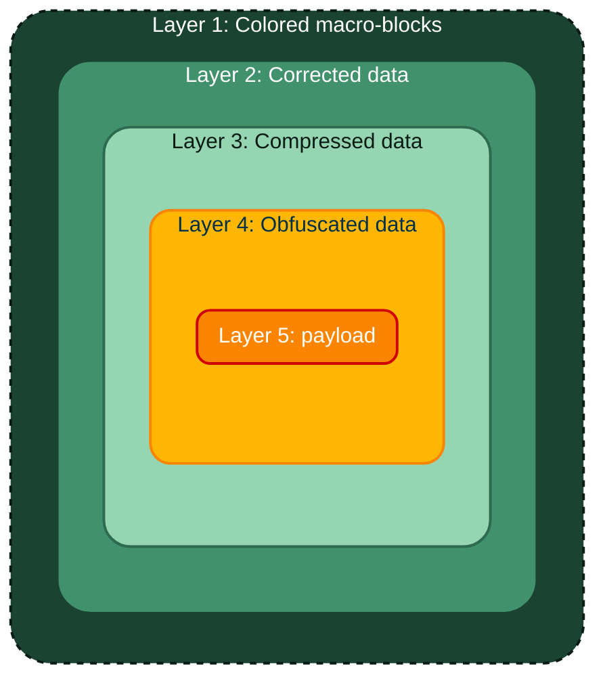
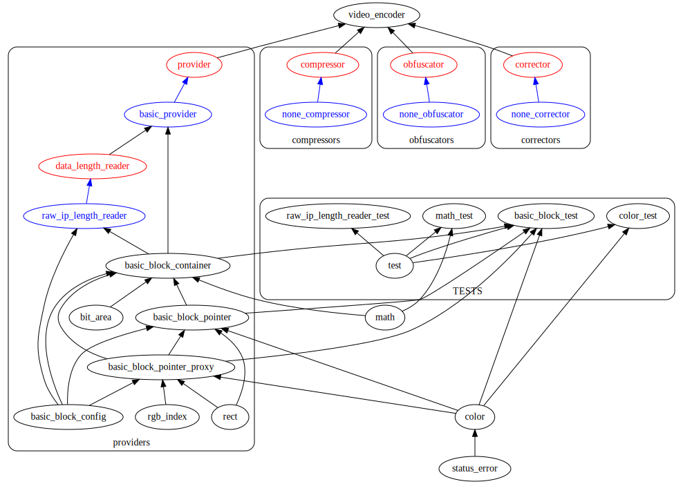

# About
This is the project to transmit and receive data throw RTMP streams. For example, over Rutube, VK video Live and WebRTC video channels in the future.
# IP package structure

# Project structure
